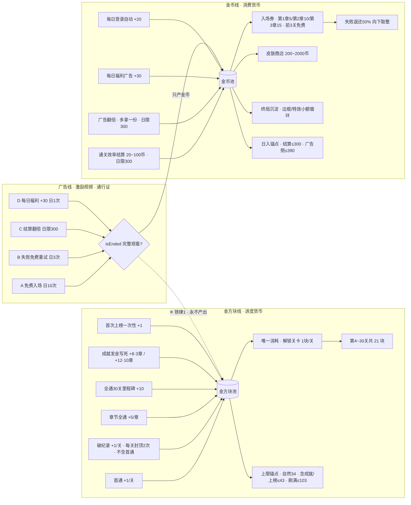

# 挖个方块 经济与商业化系统设计

## 1. 背景与设计原则

- 玩法为**章节残局闯关**（设计目标 **10 章 × 10 关 = 100 关**；当前工程可先上线前 3 章）。主题化关卡详见 [`docs/gc-chapter-stages-design.md`](./gc-chapter-stages-design.md)。经济数值若仍按 30 关锚定，扩章时需同步上调 G3/解锁终局账。
- **工坊 / 关卡广场（UGC）**为独立氛围；**不产金方块**（广场通关只发金币）；金可用于扩槽/广场解锁。详见 [`docs/gc-workshop-plaza-design.md`](./gc-workshop-plaza-design.md)。
- **铁律 1 · 金方块纯度**：金方块（`gc_goldenBlocks`）为**纯进度货币**，只用于解锁关卡；广告永不产出金方块，保障稀缺性，确保财富榜数据源纯净。
- **铁律 2 · 金币正循环**：金币（`gc_coins`）为**消费货币**，用于闯关入场券与皮肤商店；产出恒大于消耗，避免越玩越穷。
- **铁律 3 · 广告只加速**：激励视频广告**只加速金币产出**（通行证角色）；所有广告点位设**日限锚点**防刷。

## 2. 货币体系总览

三线职责一句话：**金方块 = 进度证明，金币 = 消费媒介，广告 = 金币加速器**。广告线只向金币池注水，与金方块线完全隔离。



- **金方块线（进度货币）**：产出全部来自通关 / 成就 / **一次性**上榜，消耗唯一出口是解锁关卡；周榜奖励改发**金币**，避免金方块周更通胀。
- **金币线（消费货币）**：产出靠通关效率结算 + 广告翻倍 + 登录/福利，消耗是入场券、皮肤与终局小额沉淀。
- **广告线（通行证）**：4 个点位全部围绕「免费玩」展开，只加速金币、永不碰金方块。

## 3. 排行榜与成就锚点（纠偏）

> 产品只有**章节残局闯关**（3 章 × 10 关），**没有**经典 / 限时 / 马拉松。tetris-mini 的模式分榜与技巧向成就一律废弃，不迁入挖个方块。

### 3.1 排行榜锚点：复合键（通关数优先，同行再比消行）

结构事实：玩家心智与 UI 都是**翻章选关**；单关是章内节点，不是独立模式。

**主榜排序（复合键）**：

1. **通关关数**多者优先（`clearedCount`）
2. 通关数相同 → **已通关各关个人最佳消行之和**少者优先（`Σ best.lines`）
3. 仍相同 → `Σ best.pieces` 少者优先
4. 仍相同 → `Σ best.timeMs` 少者优先

```
rankKey = (clearedCount DESC, linesSum ASC, piecesSum ASC, timeSum ASC)
linesSum = Σ stageBest[id].lines    // 仅已通关关卡；取个人最佳，非历史累计消行
```

**为何可行**：

| 阶段 | 谁在拉开差距 | 说明 |
| --- | --- | --- |
| 中前期 | 通关数 | 进度尚未顶满，先比「闯到哪」 |
| 通关数拉齐后（含全通 30） | 消行之和 | 连续可优化，不会像「只比通关数」那样全员并列卡死 |
| 全程 | 通关数永远优先于消行 | 29 关完美解法也排不进 30 关普通通关之上，避免「卡关刷优」压过推进 |

**必须遵守的口径**：

- `linesSum` 只用每关 **个人最佳** `best.lines` 再求和，**禁止**用生涯累计消行（重复刷关会把累计做大，与「越少越好」反号）。
- 只统计**已通关**关卡；未通关不计入、不垫惩罚分（惩罚分会诱使故意不点开困难关）。
- 章内解锁大体顺序推进时，同通关数玩家的关卡集合近似可比；若日后出现大量跳关，再改为「按关卡 id 集合对齐后再比」或「仅连续前缀 1..N」。

**明确不做的排行键**：

| 禁锚点 | 原因 |
| --- | --- |
| 经典 / 限时 / 马拉松分数 | 产品无此模式 |
| **单独**用通关关数 | 硬顶 30，活跃玩家很快全员拉齐 |
| **单独**用金方块持有量作主排序 | 与本复合键重复表达进度，且破纪录发金会让「刷优」和「进度」缠在一起；金方块仍作 HUD / 财富展示，**不作为主榜排序键** |
| 单关全服最少消行作主 Tab | 碎成 30 张榜，和章节 UI 不对齐 |

**榜结构**：

| 榜 | 锚点 | 是否主入口 | 说明 |
| --- | --- | --- | --- |
| **A · 闯关榜（主榜）** | 上列复合键 | **是** | 好友 / 全服共用此键；周榜可用「本周 clearedCount 增量，同则比本周 linesSum 改善」，名次奖只发金币 |
| **B · 章节效率榜（副榜，可选）** | 单章 10 关 `Σ best.lines`（须该章全通） | 二期 | 一章一张榜，给已全通章的玩家刷优 |
| **C · 单关最少消行** | 单关 `lines → pieces → timeMs` | **否** | 仅本地最佳 + 结算分享 |

**周榜**：挂在闯关榜复合键的「本周变化」上，名次奖发**金币**（见 §4.4）。

> 通关数、章节全通等仍可用于**成就**（一次性收集）。排行用复合键，成就用离散进度阈值——两者职责分开。

### 3.2 成就定稿（闭环 · 平衡）

#### 定稿结论（拍板）

| 项 | 决定 |
| --- | --- |
| 成就是否发解法类 | **否** |
| 通章 / 全通成就是否发金方块 | **否**（金走 G3/G4，成就只点亮） |
| 成就是否可用通关数阈值 | **是**（离散点亮；与排行复合键职责分离） |
| **当前上线（3 章 × 10 关）成就总数** | **12** |
| **其中发金方块的** | **6**，合计 **恰好 +8**（不再用「≤20」敞口） |
| **若扩到 10 章 × 10 关** | 成就总数 **23**（进度 18 + 社交 5）；发金合计 **恰好 +12**（社交只发币） |

#### 职责拆分

| 系统 | 职责 |
| --- | --- |
| 排行榜 | 复合键持续比拼 |
| G1~G4 | 解锁货币主线 |
| 成就 | 里程碑点亮；发金仅补主线未覆盖的稀疏阈值 |

#### 同事件不双发金

章全通 / 全关通完 / 单关首通 → 金只走 G3 / G4 / G1；对应成就 **0 金**。  
禁止设置「通关 10/20/30/…（章界）」发金成就。

#### A. 当前上线成就表（3 章 · 共 12 个）

| # | id | 条件 | 金方块 | 金币 |
| --- | --- | --- | --- | --- |
| 1 | `prog_clear_1` | 通关 ≥ 1 | +1 | 0 |
| 2 | `prog_clear_5` | 通关 ≥ 5 | +1 | 0 |
| 3 | `prog_clear_15` | 通关 ≥ 15 | +2 | 0 |
| 4 | `prog_clear_25` | 通关 ≥ 25 | +2 | 0 |
| 5 | `prog_chapter_1` | 第 1 章全通 | 0 | 0 |
| 6 | `prog_chapter_2` | 第 2 章全通 | 0 | 0 |
| 7 | `prog_chapter_3` | 第 3 章全通 | 0 | 0 |
| 8 | `prog_all_clear` | 30 关全通 | 0 | 0 |
| 9 | `prog_unlock_10` | 解锁 ≥ 10 | +1 | 0 |
| 10 | `prog_unlock_20` | 解锁 ≥ 20 | +1 | 0 |
| 11 | `social_share_1` | 首次分享 | 0 | +20 |
| 12 | `social_invite_1` | 邀请好友 ×1 | 0 | +30 |

- 成就总数：**12**
- G5 金方块：**1+1+2+2+1+1 = 8**（闭环写死，实现校验「生涯成就发金累计 ≤ 8」）

#### B. 扩到 10 章时的成就（共 20 个 · 预先定死）

不采用「每章中段都发金」（那会随章数涨到 +20 以上）。固定结构：

| 类型 | 数量 | 规则 | 金方块 |
| --- | --- | --- | --- |
| 通章点亮 | **10** | 每章 1 个，全通该章 | 全 0 |
| 全部挖通 | **1** | 100 关全通 | 0 |
| 通关发金档 | **5** | 固定阈值：1 / 5 / 25 / 50 / 75（避开 10 的倍数章界） | +1 / +1 / +2 / +2 / +2 |
| 解锁发金档 | **2** | 25 / 60（含免费关） | +2 / +2 |
| 社交 | **5** | 分享、邀请、发起挑战、应战、近十局全胜 | 0 金（+20/+30/+20/+20/+50 币） |
| **合计** | **20** | — | **G5 = +12** |

10 章时实现校验：生涯成就发金累计 **≤ 12**。通章从 3→10 只增加 **0 金** 徽章，金方块池不被章节膨胀击穿。

#### 闭环账（成就段）

| 口径 | 3 章（上线） | 10 章（预留） |
| --- | --- | --- |
| 成就个数 | 12 | 20 |
| G5 发金 | **+8** | **+12** |
| 相对 G1~G4 自然持有 | 8 / 34 ≈ 24% 点缀 | 仍为点缀；主增量仍是首通净零 + 章奖 |
| 解法 / 破纪录 | 不进成就 | 同左 |

#### 明确删除

高分、T-Spin、Combo、B2B、存活、累计消行肝帝、好友榜名次、七种块、实验室——全部不迁入。

## 4. 金方块线（进度货币）

### 4.1 产出

| 编号 | 产出项 | 数量 | 触发条件 | 备注 |
| --- | --- | --- | --- | --- |
| G1 | 首通奖励 | +1/关 | 每关首次通关 | 30 关共 +30；**首通只发 G1，不叠发 G2** |
| G2 | 破纪录奖励 | +1/关 | 在已有通关纪录基础上，**消行数严格优于个人最佳** | 每关累计**封顶 2 次**（键 `gc_stageRewardCount_{id}`）；首通写入最佳时不计入次数；解法激励走 G2 + 金币结算，**不进成就** |
| G3 | 章节全通奖 | +5/章 | 一章 10 关全部通关 | 3 章共 +15（键 `gc_chaptersCleared` 防重复，复用 `isCleared` 全判） |
| G4 | 全通里程碑 | +10 | 30 关全部通关 | 一次性 |
| G5 | 成就奖励 | **写死 +8**（3 章表）；扩 10 章时 **+12** | 见 §3.2；与 G1~G4 同事件不双发 | 实现校验生涯成就发金累计上限 |
| G6 | 首次上榜 | +1 | **闯关榜**（复合键）生平首次上榜 | 一次性（云函数标记已领）；周榜名次奖发金币，见 §4.4 |

### 4.2 消耗

- 前 3 关免费；第 4~30 关每关解锁消耗 **1 块**，共 21 关 × 1 = **21 块**。
- 除解锁外没有任何其他消耗出口，金方块与财富榜「进度属性」完全一致。

### 4.3 循环自洽与终局账

- **启动资金**：前 3 关首通即提供 **3 块**，足以解锁第 4 关（1 块）后仍有余量。
- **净零循环**：第 4~30 关每关「解锁 −1 → 首通 +1」净零，玩家永远不会因金方块耗尽而卡死。
- **章间余量**：第 1 章结束后约持有 8 块（首通 10 − 解锁 7 + 章奖 5），足够开启第 2 章连续解锁，不会卡在章门。

| 账目项 | 数量 |
| --- | --- |
| 首通 30 关 | +30 |
| 章节全通 3 章（+5/章） | +15 |
| 全通 30 关里程碑 | +10 |
| 解锁消耗（第 4~30 关） | −21 |
| **全通自然持有（仅 G1~G4）** | **34** |
| 成就发金（G5 · 3 章定稿） | **+8** |
| 首次上榜（G6） | +1 |
| **含成就/上榜上限** | **43** |
| 破纪录刷满（30 关 × 2 次） | +60 |
| **极限持有（含成就/上榜）** | **103** |

> 成就不再预留「≤20」敞口，避免实现时加档失控。扩至 10 章时 G5 改为 +12，通章徽章加数量不加金。

### 4.4 榜单奖励分流（闭环补丁）

| 奖励 | 货币 | 说明 |
| --- | --- | --- |
| 闯关榜生平首次上榜 | 金方块 +1 | 一次性，计入进度 |
| 闯关周榜前 10 / 章节效率周榜前 10 | **金币** +50 / +80 / +100…（具体档另表） | **不发金方块** |
| 周榜参与奖 | 金币小额（可选） | 同上 |

## 5. 金币线（消费货币）

### 5.1 效率结算制（废弃旧消行即时发币）

> 旧规则：每消一行即时发币 → 已废弃（移除 `rewardLineClear` / `LINE_CLEAR_REWARDS`）。
> 新规则：**每局通关后按效率一次性结算**，鼓励少消行刷纪录（与 G2 破纪录同向，但不进成就）。

**结算公式**（先钳制再计算）：

```
lines' = clamp(实际消行, minLines, T)    // 低于理论最少按最优计；高于 T 按保底计
金币   = 20 + round((T − lines') / (T − minLines) × 80)
金币   = clamp(金币, 20, 100)
```

- `T = coinThreshold = minLines × 2`（关卡表**显式字段** `coinThreshold`；缺省回退 `minLines×2`；`minLines ≥ 1`）。
- 实际消行 ≥ T → 保底 **20**；实际消行 ≤ minLines → 封顶 **100**。
- **T 随关卡难度递进**：章内/章间 `minLines` 非降（见 [`gc-chapter-stages-design.md`](./gc-chapter-stages-design.md)），高难关刷优空间更宽。例：第 1 章关 1 `minLines=3→T=6`；第 10 章 Boss `minLines=15→T=30`。

**示例（第 1 关 · minLines=4 · T=8）**：

| 实际消行 | ≤4 | 5 | 6 | 7 | ≥8 |
| --- | --- | --- | --- | --- | --- |
| 结算金币 | 100 | 80 | 60 | 40 | 20 |

**规则**：

- 每次通关都结算，鼓励刷更少消行；通关失败不给金币。
- **基础结算**每日上限 **300 币**（键与 `DAILY_LIMIT` 对齐；由 600 砍半）。
- 三指标中**只用消行数**计酬；用块数 / 用时只进本地个人最佳与（可选）章节效率榜，不与金币重复计酬。

### 5.2 门票制（核心商业化环）

- **入场二选一**：消耗金币购买入场券，或看激励视频免费入场；**第 1~3 关入场费为 0**（新手保护，与章节表「第 1 章 5 币」并存时以本条为准）。
- **定价**：第 1 章第 4~10 关 **5 币**、第 2 章 **10 币**、第 3 章 **15 币**。
- **失败退还 50%**：仅对**本局实付金币入场**生效；广告免费入场失败**不退币、不扣币**。花 5 币输掉拿回 2 币（向下取整）。

| 章节 | 关卡 | 入场费 | 失败退还（50% 向下取整） |
| --- | --- | --- | --- |
| 第 1 章 | 第 1~3 关 | **0（免费）** | — |
| 第 1 章 | 第 4~10 关 | 5 币 | 2 币 |
| 第 2 章 | 第 11~20 关 | 10 币 | 5 币 |
| 第 3 章 | 第 21~30 关 | 15 币 | 7 币 |

### 5.3 消费端对齐（皮肤商店）

- 皮肤价格区间（`data/skins.js` 实测）：**200 ~ 2000 金币**，主流档 **300 ~ 600 币**。
- 节奏校验：完美通关一局 100 币，普通玩家日入 100~300 币 → **3~6 天一个主流皮肤**；30 关全完美一次性收入 **3000 币**（未计日限；实际被日限摊到多天）。

### 5.4 登录福利与广告福利（互不替代）

| 项 | 数量 | 触发 | 备注 |
| --- | --- | --- | --- |
| 每日登录 | +20 | 当日首次进入关卡选择/首页自动发放 | 不看广告；一日一次 |
| 每日福利 D | +30 | 首页入口，完整观看激励视频 | 与登录独立；可叠加为日入 +50 |

### 5.5 终局金币沉淀（闭环补丁）

皮肤全收集后，日入仍大于入场消耗，金币会无限堆积。补一条**低强制**消耗口，避免纯数字膨胀影响体感：

| 沉淀项 | 定价意向 | 说明 |
| --- | --- | --- |
| 棋盘边框 / 消除特效小件 | 80~300 / 件 | 纯外观，可持续扩目录 |
| 已有皮肤「色调变体」 | 150~400 | 复用美术，提高皮肤线寿命 |
| （可选）周常挑战额外入场 | 与章票同级 | 有限次数，防日耗过高 |

短期末上线沉淀前：允许软膨胀，但**财富榜只读金方块**，金币余额不上财富榜。

## 6. 广告线（激励视频 · 通行证）

> 复用 `utils/ad-manager.js` 现有 `showRewardedVideo()`（返回 `Promise<boolean>`，以 `isEnded` 判定完整观看）与既有频率控制；未完整观看不发放任何奖励。  
> **Banner / 插屏**（被动曝光、不发奖励）：策略见 [`gc-ad-banner-interstitial.md`](./gc-ad-banner-interstitial.md)；待 `AD_UNIT_IDS` 接入后再实现。

| 点位 | 名称 | 触发场景 | 奖励 / 效果 | 日限 |
| --- | --- | --- | --- | --- |
| A | 免费入场 | 关卡入场弹窗 | 免金币入场（省 5~15 币） | **10 次/天** |
| B | 失败免费重试 | 失败结算页 | 免费重试本局（**不发安慰币**；替代旧失败安慰发币） | **3 次/天** |
| C | 结算翻倍 | 通关结算页 | 再发一份与本局基础结算等额的金币 | **额外 +300 币/天**（与基础日限分池） |
| D | 每日福利 | 首页入口 | +30 金币 | **1 次/天** |

### 6.1 翻倍与日限分池（必须写清）

| 池子 | 计入内容 | 日上限 |
| --- | --- | --- |
| 基础结算池 `DAILY_LIMIT` | `rewardStageClear` 发出的基础金币 | **300** |
| 广告翻倍池 `AD_DOUBLE_LIMIT` | 点位 C「多拿的那一份」 | **300** |
| 不占上述两池 | 每日登录 +20、点位 D +30；点位 A/B 为免票/免重试（省支出，不记入「产出」） | — |

例：本局基础结算 100，看完 C → 再 +100；若基础池已满则基础为 0，C 不可发起（无「多拿一份」的基数）；若翻倍池剩余 40，则 C 只再发 40。

### 6.2 广告日顶格口径

- **C 顶格**：+300（翻倍池）
- **D**：+30
- **A 折算（省票，非入账）**：按实际所跳过章票累计，第 1 章为主时约 **50~70**，跨章均摊常见 **60~100**；图中「≈60」取第 1 章偏多场景的保守折算，**不是**打入金币余额的数字
- 广告相关**入账**顶格：**C 300 + D 30 = 330**；加上登录 20、基础结算 300 → 日入理论顶 **650**（原「710」含把 A 省票误算进产出，已修正）

## 7. 经济账验证与风险对策

### 7.1 数值验证（按平均票价 10 币计）

| 场景 | 收入 | 支出 | 净收益 |
| --- | --- | --- | --- |
| 单局最优（完美通关） | 100 | 入场 10 | +90 |
| 单局最差（保底通关 20 币） | 20 | 入场 10 | +10 |
| 单局失败 | 0 | 入场 10 − 退还 5 | −5 |

- **最差结算也是正收益**（净 +10）：只要通关就不亏，挫败感只来自「不够完美」，符合残局挑战定位。
- **失败单次净亏 5 币**：连续失败时广告免费入场 / 免费重试兜底，挫败 → 广告转化正是设计目标。
- **每日顶格入账**：登录 20 + 基础结算 300 + 翻倍 300 + 福利 D 30 = **650**；入场消耗顶格约 **300 币/天**（含失败净亏）。**产出仍大于消耗**。

### 7.2 风险对策

| 风险 | 表现 | 对策 |
| --- | --- | --- |
| 风险 1 · 卡进度 | 金币耗尽无法入场，玩家流失 | 三层兜底：广告免费入场 10 次/天 + 失败退还 50% + 每日登录 20 币；最坏情况下每天也能玩 10 局 |
| 风险 2 · 广告疲劳 | 点位多、次数多引发反感 | 四个点位合并语义为「看广告免费玩」，理解成本低；日限锚点全部收敛 |
| 风险 3 · 金方块被稀释 | 进度货币被广告 / 金币 / 周榜污染 | 铁律 1 + 周榜只发金币 + **G5 写死 +8/+12** |
| 风险 4 · 结算爆表 | 异常消行 &lt; minLines 导致公式 &gt;100 | `lines'` 与结果双钳制到 \[20, 100\] |
| 风险 5 · 终局金币膨胀 | 皮肤买完后只进不出 | 5.5 外观小额沉淀；财富榜不读金币余额 |
| 风险 6 · 双池歧义刷满 | 翻倍是否占用基础日限不清 | 6.1 分池：基础 300 与翻倍 300 独立 |

### 7.3 已修订缺口一览（相对初稿）

| 缺口 | 初稿问题 | 修订 |
| --- | --- | --- |
| 周榜发金方块 | 每周通胀，终局 34/94 失真 | G6 仅财富榜首次上榜 +1；周榜改金币 |
| 成就无总量 | 旧成就大额 reward / ≤20 敞口 | G5 写死 3 章 +8、10 章 +12；通章 0 金 |
| 解法做成成就 | 难检测、与破纪录/结算重复 | 成就只保留进度系；解法只走 G2 + 金币 |
| 排行锚点错位 | 模式分榜 / 只比通关数易拉齐 / 只比金方块缠进度与刷优 | **复合键**：通关数 DESC → Σ最佳消行 ASC（→ pieces → time）；金方块不作主排序键 |
| 首通叠破纪录 | 首通是否同时 +G2 未写清 | 明确首通只 G1；G2 仅严格更优 |
| 公式无下界钳制 | 消行 &lt; minLines 可算出 &gt;100 | clamp 输入与输出 |
| 翻倍 vs 日结 | 「×2」与两个 300 谁扣谁 | 基础池 / 翻倍池分账 |
| A 折算进 710 | 省票被当成入账 | 日入顶格改为 650；A 只作省支出口径 |
| 第 1~3 关票价 | 表写 5 币与正文免费冲突 | 表内单列免费 |
| 失败安慰发币 | 落地清单与广告重试矛盾 | 删除安慰币；只保留广告重试 |
| 登录 vs 福利 | 两处 +20/+30 关系不清 | 5.4：登录自动，D 看广告，可叠加 |
| 终局无金币出口 | 正循环变成单向堆积 | 5.5 外观沉淀 |

## 8. 落地清单（改动文件与接口）

| 文件 | 改动内容 |
| --- | --- |
| `utils/coin-manager.js` | ① 废弃 `rewardLineClear` / `LINE_CLEAR_REWARDS`；② 新增 `rewardStageClear(lines, minLines)`：效率结算 + 双钳制，受 `DAILY_LIMIT`（300）约束；③ `spendEntryFee` / `refundEntryFee`：章票 5/10/15、前 3 关免费、仅实付失败退 50%；④ 新增 `rewardAdDouble(baseAmount)`，受 `AD_DOUBLE_LIMIT`（300）约束；⑤ 每日登录 +20 自动领取；⑥ **不**再实现失败安慰发币 |
| `utils/golden-block-manager.js` | ① 破纪录封顶；② 章节全通 / 全通里程碑；③ 成就发金累计校验 ≤8（10 章时 ≤12）；④ 闯关榜首次上榜 +1 |
| `data/achievements.js` + `achievement-manager.js` | 按 §3.2 重写为 12 条进度成就；发金累计校验 ≤8；删除技巧向 |
| `js/scenes/game-scene.js`（关卡结算处） | ① 通关调 `rewardStageClear`；② 失败页「看广告免费重试」（日 3）；③ 结算页「看广告再领一份」（走翻倍池） |
| `js/scenes/stage-select-scene.js` | ① 卡片展示入场费（1~3 关「免费」）；② 已解锁关卡弹「花 X 币 / 看广告免费入场」 |
| `js/scenes/home-scene.js` 或关选首页 | 每日登录自动 +20；每日福利广告入口 D（+30，日 1） |
| `js/scenes/rank-scene.js` + `cloudfunctions/rank` | **去掉** classic/timed/marathon；主榜上报 `(clearedCount, linesSum, piecesSum, timeSum)`；周榜发金币；可选章节效率副榜 |

## 9. 附录：数值对照与速查表

### 表 A · 入场费 / 结算参数对照

| 章节 | 关卡 | 入场费 | 失败退还（50% ↓） | 结算参数备注 |
| --- | --- | --- | --- | --- |
| 第 1 章 | 第 1~3 关 | 0 | — | 新手免费入场 |
| 第 1 章 | 第 4~10 关 | 5 币 | 2 币 | 第 1 关 minLines=4 → T=8；第 10 关 minLines=10 → T=20；中间按各自 `minLines` |
| 第 2 章 | 第 11~20 关 | 10 币 | 5 币 | 同一公式 |
| 第 3 章 | 第 21~30 关 | 15 币 | 7 币 | 同一公式 |

### 表 B · 皮肤价格对照（`data/skins.js` 实测）

| 档位 | 价格（金币） | 定位 | 获取节奏（按保守日入 100 币估算） |
| --- | --- | --- | --- |
| 基础款 | 200 ~ 300 | 新手首选 | 2 ~ 3 天 |
| 主流款 | 300 ~ 600 | 商店主流档 | 3 ~ 6 天 |
| 稀有款 | 600 ~ 1200 | 进阶收藏 | 6 ~ 12 天（约 1 ~ 2 周） |
| 传说款 | 1200 ~ 2000 | 高价门面 | 12 ~ 20 天（约 2 周以上） |

> 日入 300 币的活跃玩家可缩短至以上时间的 1/3。

### 表 C · 结算金额示例

| 关卡 | minLines / T | 最优 | 中间档示例 | 保底 |
| --- | --- | --- | --- | --- |
| 第 1 关 | 4 / 8 | 消≤4行 → 100 | 消5行→80、消6行→60、消7行→40 | 消≥8行 → 20 |
| 第 10 关 | 10 / 20 | 消≤10行 → 100 | 消12行→84、消14行→68、消16行→52、消18行→36 | 消≥20行 → 20 |

### 表 D · 广告点位锚点速查

| 点位 | 名称 | 触发 | 日限 |
| --- | --- | --- | --- |
| A | 免费入场 | 入场弹窗 | 10 次/天（省票，不入账） |
| B | 失败免费重试 | 失败结算页 | 3 次/天（不发币） |
| C | 结算再领一份 | 通关结算页 | 额外 +300 币/天（翻倍池） |
| D | 每日福利 | 首页 | 1 次/天 · +30 币 |

### 表 E · 金方块终局锚点速查

| 口径 | 持有上限 |
| --- | --- |
| 仅主线（G1~G4 − 解锁） | 34 |
| + 成就 +8 + 首次上榜 +1 | **43** |
| + 破纪录刷满 | **103** |
| 周榜 | **0 金方块**（只发金币） |
