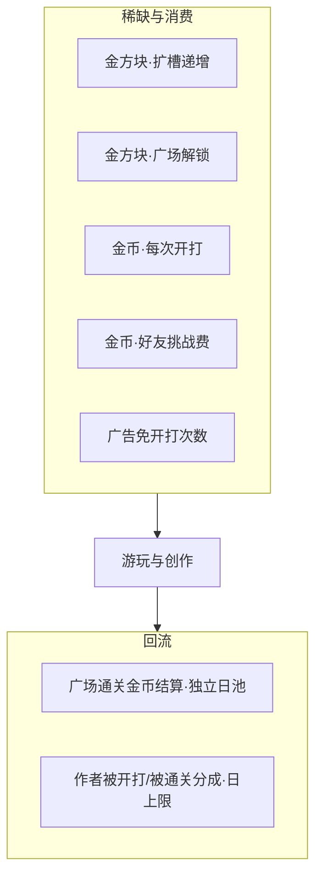

# 挖个方块 · 工坊模式与关卡广场（定稿草案）

> 目标：在**闯关模式**之外增加**工坊模式**（UGC 造关 + 好友挑战 + 广场发布），形成可商业化、可平衡的闭环。  
> 对齐：[`gc-economy-design.md`](./gc-economy-design.md) 三铁律；[`gc-chapter-stages-design.md`](./gc-chapter-stages-design.md) 摆关硬约束；现有好友挑战云函数。  
> 原则：**金方块永不进工坊产出**（可作稀缺消耗：扩槽 / 广场解锁）；创作免费；游玩对齐主线「金解锁 + 币挑战」；主线进度与财富榜不被 UGC 击穿。

---

## 1. 产品定位

### 1.1 两大氛围（首页一级切换）

| 氛围 | 职责 | 进度货币 | 消费 |
| --- | --- | --- | --- |
| **闯关模式** | 官方 10×10 主题关、解锁、复合榜 | 金方块 + 金币 | 入场券 / 广告免费入场 |
| **工坊模式** | 自建关、自测、好友挑战、广场 | 消耗金（扩槽/解锁）+ 金币挑战 | **不产金方块**；通关只发金币 |

玩家心智：

- 闯关 =「推进剧情与进度证明」  
- 工坊 =「创作与社交竞技 / 内容消费」

### 1.2 工坊页信息架构

```
工坊
├─ Tab「我的关卡」
│   ├─ 子 Tab：待自通 | 已通关 | 审核中 | 已发布
│   └─ （可选）已驳回 / 已下架 并入「已通关」列表用标签区分
├─ Tab「关卡广场」
│   └─ 新关 / 热门 / 好通关 / 好友在玩
└─ 底栏主按钮「创建关卡」（两 Tab 共用）
```

详情页（已发布 / 广场共用组件）：作者信息、发布日期、被挑战次数、通关次数、开打次数、通关率、热度、缩略盘面、开始游玩 / 发起挑战。

---

## 2. 状态机与操作闭环

### 2.1 关卡状态

| 状态 id | 展示名 | 含义 |
| --- | --- | --- |
| `draft` | 待自通 | 已保存布局，作者尚未通关 |
| `cleared` | 已通关 | 作者已用**当前布局快照**自通 |
| `reviewing` | 审核中 | 已提交广场，等待机审/人审 |
| `published` | 已发布 | 审核通过，广场可见 |
| `rejected` | 已驳回 | 审核未过（列表可并入已通关，强标签） |
| `delisted` | 已下架 | 作者下架或运营下架（广场不可见） |

### 2.2 状态迁移（硬性）

```
创建 ──► draft ──自通成功──► cleared ──提交发布──► reviewing ──通过──► published
              ▲               │  ▲                  │驳回              │下架
              │               │  └──────────────────┘                  ▼
              └──编辑改盘──────┴──（作废通关凭证，强制重通）──────────► cleared / draft
```

**铁律 · 布局快照**：

- 「自通」绑定 `layoutHash`；改任何一个垃圾格 → 状态回 `draft`，清空该关通关纪录与在审稿。  
- 「提交审核 / 好友挑战」使用**提交瞬间快照**；审核中途不可静默改盘（须先撤回再改）。

### 2.3 「我的关卡」四子 Tab 与操作

| 子 Tab | 可操作 | 禁止 |
| --- | --- | --- |
| **待自通** | 编辑、试玩（自挑战）、删除 | 发布、向好友发起挑战、进广场 |
| **已通关** | 发起好友挑战、提交发布、编辑（触发重通）、删除 | 直接进广场 |
| **审核中** | 发起好友挑战（用提交快照）、撤回审核、查看 | 编辑布局（须先撤回） |
| **已发布** | 发起好友挑战、查看详情、下架 | 直接改盘（须下架→已通关→编辑→重通→再提） |

驳回：回 **已通关** + 驳回原因；可改盘（变待自通）或原盘重提（仍算新一次提交，耗当日提交次数见 §4）。

### 2.4 关卡广场闭环（对齐闯关章节）

```
浏览广场 ──► 详情
              ├─ 未解锁 ──► 消耗金方块解锁（同主线心智）
              └─ 已解锁 ──► 消耗金币开打（可广告免）──► 通关/失败
                                                      │
                                                      └─ 通关结算：只发金币，0 金方块
```

作者侧：`published` 关被游玩 / 被通关 → 计入详情统计 → 热度更新 → 作者金币分成（日上限）。
### 2.5 与好友挑战的关系

| 来源 | 是否需审核 | 说明 |
| --- | --- | --- |
| 已通关 / 审核中 / 已发布 → 好友挑战 | 否 | 私域即时；用对应快照 |
| 提交广场 | 是 | 公域；过审才上架 |

挑战结算仍用现有 `challenge` 云函数；扩展 payload：`workshopStageId` + `layoutSnapshot`（或云端 stage 引用）。

---

## 3. 编辑器与可玩性约束（平衡 · 防死关）

沿用官方硬约束，工坊额外收紧，避免恶心关污染广场：

| 规则 | 工坊要求 |
| --- | --- |
| 禁止满行 | 是 |
| 每垃圾行至少一个 `.` | 是 |
| 顶垃圾行 | ≥ 6（Boss 式稀有模板可 ≥ 4，须用官方模板） |
| 垃圾格数 | **8～80**（过少无趣、过多劝退） |
| 含垃圾行数 `minLines` | **3～16** |
| 贴底率 | 不强制；引导「抬升/剪影」模板 |
| 标准 7 块 | 是 |
| 自通凭证 | 必须；否则不可发布、不可好友挑战 |

编辑器能力（MVP）：点涂 / 橡皮 / 清空 / 镜像 / 从官方模板拷贝轮廓 / 撤销。  
高级（后期）：一键抬升、镂空笔刷。

**可解性**：MVP 以「作者自通」为唯一硬门禁；后期可加机审启发式（近满行过多、无空列通道等）打标，不替代自通。

---

## 4. 商业化设计

### 4.1 商业化原则（对齐三铁律）

1. **金方块零产出**：工坊通关、发布、热度、分成、订阅 → **一律 0 金方块**。广场通关**只奖励金币**。  
2. **金方块可作稀缺 Sink**（不破坏纯度）：仅用于 **扩创作槽位**、**解锁广场关卡**；广告永不发金。  
3. **创作免费**：创建 / 编辑 / 自通 / 提交发布 **不收金币、不收人民币**；用槽位 + 自通 + 日提交上限控量。  
4. **游玩对齐主线**：广场关 = **金解锁 → 每次开打耗金币**（失败退 50%、可广告免）。  
5. **UGC 不进主榜复合键**：官方 `clearedCount` 只计官方关；工坊另立热度/作者榜（只发金币或徽章）。

### 4.2 收入与消耗结构



### 4.3 创作槽位（金方块递增扩容）

| 规则 | 定值 |
| --- | --- |
| 免费槽位 | **3** |
| 硬顶 | **10**（含免费；不可再扩，月卡也不加槽） |
| 扩容货币 | **仅金方块**（不用金币、不用广告换槽） |
| 占槽对象 | 草稿 / 已通关 / 审核中 / 已发布 / 已下架均占 1 槽；删除才腾槽 |

**扩容价表（第 N 个槽的开通价，必须递增）**：

| 开通后总槽数 | 本次消耗金方块 | 累计金消耗 |
| --- | ---: | ---: |
| 3（默认） | 0 | 0 |
| 4 | **2** | 2 |
| 5 | **3** | 5 |
| 6 | **5** | 10 |
| 7 | **8** | 18 |
| 8 | **12** | 30 |
| 9 | **18** | 48 |
| 10 | **25** | **73** |

说明：

- 故意高于「主线 1 金解锁 1 关」，避免扩槽比推主线还便宜。  
- 拉满 10 槽约 **73 金**，接近一名深度玩家多章余量，属于长线目标而非随手点。  
- UI 二次确认：「扩槽将消耗 N 金方块，主线解锁仍需金方块，确认？」  

### 4.4 广场游玩（金解锁 + 币挑战）

与闯关章节同一心智：

| 步骤 | 消耗 | 说明 |
| --- | --- | --- |
| 解锁某广场关 | **1 金方块 / 关**（永久对本账号） | 未解锁不可开打，可预览盘面 |
| 每次开打 | **金币**按难度档 **8 / 12 / 16** | 失败退还 **50%**（仅实付金币） |
| 广告免开打 | **日 8 次** | 未配置广告则隐藏 |
| **通关奖励** | **仅金币**（12～40，效率缩水版） | **严禁发金方块**；独立日池 `WORKSHOP_CLEAR_DAILY` ≤ **120** |
| 重复通关同关 | 当日结算 **×0.3**，仍吃日池 | 防刷币 |

**难度分档（开打金币）**：

| 档 | 条件（满足任一） | 开打费 |
| --- | --- | --- |
| 轻 | `minLines≤6` 且 `garbageCount≤24` | 8 |
| 标准 | 其它 | 12 |
| 重 | `minLines≥12` 或 `garbageCount≥50` | 16 |

可选护栏（防金被 UGC 吸干）：同时「已解锁且未首通」的广场关 ≤ **5**；或仅「热门 / 精选」要金解锁、普通关只币开打——MVP 先上「一律 1 金解锁」，数据后再调。

### 4.5 其余定价锚点

| 项目 | 初值 | 说明 |
| --- | --- | --- |
| 创建 / 编辑 / 提交发布 | **免费** | 不收发布费 |
| 日提交广场次数 | **3 次 / 日** | 无费控垃圾量；月卡可提到 10 |
| 待自通试玩 | **免费**（日 30 次防脚本） | 鼓励打磨 |
| 已通关 → 好友挑战 | **10 币 / 次**（广告免日 5） | 私域 |
| 作者分成·被开打 | **1 币** | 排除自己 |
| 作者分成·被通关 | **4 币** | 排除自己 |
| 作者分成日上限 | **80 币 / 作者 / 天** | 防自刷 |
| 可选月卡 | 真金 IAP | **不加槽**；给日提交 + 广告免次数等 |
| 工坊成就 | 只发金币/徽章 | **0 金方块** |

### 4.6 防刷与套利

| 手段 | 规则 |
| --- | --- |
| 自刷分成 | 游玩者 openid ≠ 作者 |
| 重复刷同一关 | 首通满额；当日重复 ×0.3 + 日池 |
| 改盘骗审 | `layoutHash`；审核中禁止改盘 |
| 垃圾投稿 | 日提交上限 + 自通 + 机审（**无发布费**） |
| 广告刷免 | 独立日限；无广告位则隐藏 |
| **金方块隔离（产出）** | 工坊结算路径禁止 `grant*Gold`；通关断言奖励金 = 0 |
| **金方块消耗白名单** | 仅 `expandWorkshopSlot`、`unlockPlazaStage` |

### 4.7 商业化节奏

| 阶段 | 付费点 | 目标 |
| --- | --- | --- |
| MVP | 广场金解锁 + 币开打 + 好友挑战费 + 广告免 | 验证 UGC 消费 |
| v1.1 | 槽位金扩容表上线 | 金 Sink + 创作上限 |
| v1.2 | 创作者月卡（不卖槽） | ARPU |
| v2 | 精选进彩蛋章 | 品牌 + 长留 |

---

## 5. 经济平衡（与主线共存）

### 5.1 池子隔离

| 池 | 内容 | 日上限 |
| --- | --- | --- |
| 主线基础结算 | 官方关 `rewardStageClear` | 300 |
| 主线广告翻倍 | 官方结算翻倍 | 300 |
| **工坊通关结算** | 广场通关（**仅金币**） | **120** |
| **工坊作者分成** | 被开打/被通关 | **80 / 作者** |
| 工坊广告免 | 免开打/免挑战费 | 次数制 |

主线「最差通关仍净赚」体验保留；工坊允许「玩广场略亏、造好关略赚」，靠分成日上限防止职业刷子。

### 5.2 粗算（活跃玩家）

假设某日：已解锁广场玩 6 局（均 12 币开打，通 4 败 2，通关结算均 24）：

- 开打支出：约 `6×12 = 72`，失败退还 `2×6 = 12` → 净票 **60**  
- 通关入账：`4×24 = 96`（日限 120）→ **96**，**其中金方块 +0**  
- 当日工坊净币：`96 - 60 ≈ +36`；金方块仅在解锁新关时 −1/关  

作者侧：关卡被通 20 次 → 理论 80 币，**触达日上限 80**。

### 5.3 对主线的保护

- 工坊**任何路径不发金方块** → 官方解锁仍靠主线产出。  
- 扩槽 / 广场解锁会**消耗**金方块 → UI 提示保留主线需求；财富榜读持有量，花金解锁 UGC 会掉榜（可接受）。  
- 复合榜不统计工坊通关。  
- 精选 UGC 进彩蛋章：复制为官方关后再走 G1，不把直播 UGC 塞进主线。

---

## 6. 数据与统计

### 6.1 关卡文档（云集合 `workshop_stages` 示意）

```
{
  stageId, authorOpenid, authorName, authorAvatar,
  title, status,           // draft|cleared|reviewing|published|rejected|delisted
  layout, layoutHash,      // rows 同官方 encoding
  minLines, garbageCount, coinThreshold, dropIntervalMs,
  authorBest: { lines, pieces, timeMs, clearedAt },
  stats: {
    playCount,             // 开打
    clearCount,            // 通关
    challengeSendCount,    // 被用来发起挑战次数
    likeCount              // 可选
  },
  heatScore,               // 见 §6.2
  review: { submittedAt, reviewedAt, rejectReason, snapshotId },
  createdAt, updatedAt, publishedAt
}
```

本地草稿可先存 `wx.storage`，提交/挑战时再上云。

### 6.2 热度公式（写死，详情「受欢迎程度」）

```
heatScore =
    clearCount * 3
  + playCount * 1
  + challengeSendCount * 2
  + likeCount * 2
  - 年龄衰减（按 publishedAt 每满 7 天 ×0.92，底 0.5）
```

详情展示：

- 被挑战次数 = `challengeSendCount`  
- 通关次数 = `clearCount`  
- 通关率 = `clearCount / max(playCount, 1)`  
- 受欢迎程度 = 热度档（冷门 / 一般 / 热门 / 爆款）由 `heatScore` 阈值切分  

广场排序：`新关`=`publishedAt`；`热门`=`heatScore`；`好通关`=`通关率`（且 `playCount≥N`）；`好友在玩`=好友最近开打过的 stageId。

### 6.3 审核流水

机审：硬约束、hash 重复、敏感词标题、作者未自通。  
人审队列：机审通过进入；运营可过/驳/下架。  
MVP 可「机审通过即上架 + 事后抽检」，但文档保留人审位，商业化后必开。

---

## 7. 客户端页面与流程（实现清单）

### 7.1 页面

| 页面 | 说明 |
| --- | --- |
| 首页 | 大气氛：**闯关 \| 工坊** |
| 工坊页 | 双 Tab + 底栏创建 |
| 编辑器页 | 10×20 点阵；保存→待自通 |
| 试玩/挑战局 | 复用 `game` + `initStage(layout)`；`mode=workshop` |
| 工坊结算 | 不分金方块；走工坊币池 |
| 详情页 | 统计 + 游玩/挑战 CTA |
| 运营审核台 | 可二期；先云开发控制台 |

### 7.2 创建关卡主路径

1. 工坊 → 创建关卡（检查槽位；满则引导金扩容，已满 10 则不可）  
2. 编辑保存 → **待自通**  
3. 自挑战通关 → **已通关**（写入 authorBest + layoutHash）  
4a. 发起好友挑战（扣挑战费 / 广告免）  
4b. 免费提交发布（耗日提交次数）→ **审核中**  
5. 通过 → **已发布** → 广场可见  
6. 他人：**金解锁** → **币开打** → 通关只发金币 + 作者分成  

### 7.3 暂停与入场

- 工坊对局暂停页：**无「重新开始」**（与闯关一致，防免费重打）。  
- 退出回工坊列表；再玩须重新付开打/挑战费。

---

## 8. 平衡性专项检查表

发布前用下表验收：

- [ ] 任意工坊通关路径 `grantGoldenBlock === 0`（广场通关只发金币）  
- [ ] 官方复合榜 API 不读 workshop 通关  
- [ ] 作者分成有日上限且排除自己  
- [ ] 改盘导致 hash 变化并降级状态  
- [ ] 审核中/已发布挑战用快照而非脏草稿  
- [ ] 未配置广告时隐藏工坊广告入口  
- [ ] 日提交上限生效；**无发布费**  
- [ ] 广场通关日池与主线 300 池分离  
- [ ] 免费 3 槽；扩容按递增金价表；硬顶 10  
- [ ] 广场须先金解锁再币开打  
- [ ] 槽位满时不可创建，引导扩容（非月卡加槽）

---

## 9. 分阶段交付

| 阶段 | 范围 | 商业化 |
| --- | --- | --- |
| **P0 · MVP** | 编辑器、我的四态、自通、好友挑战、本地/云存档、**3 槽** | 挑战费 + 广告免 |
| **P1** | 提交审核、广场、**金解锁 + 币开打**、机审、热度 | 开打费 + 作者分成日限 |
| **P2** | 人审、举报、**递增金扩槽至 10**、工坊成就（0 金） | 月卡（不加槽） |
| **P3** | 精选进彩蛋章、周刊 | 内容品牌 |

---

## 10. 风险与对策

| 风险 | 对策 |
| --- | --- |
| 不可解/恶心关 | 强制自通 + 约束 + 通关率监控下架 |
| UGC 通胀金币 | 独立日池 + 分成上限 + 重复通关衰减 |
| 冲击主线进度 | 禁金方块 + 禁主榜 |
| 审核成本 | 先机审后抽检；日提交上限降量（无发布费） |
| 侵权/辱骂图案 | 标题审 + 举报 + 下架；图案类后期再加模型 |
| 创作意愿不足 | 免费创作 + 模板 + 被通关分成 |
| 扩槽过易 / 过难 | 递增金价（2→25）；拉满约 73 金，可按数据调表 |
| 主线金被吸干 | 解锁二次确认；可选「未首通广场解锁位」上限 |

---

## 11. 与现有文档的衔接

- 经济总则仍以 `gc-economy-design.md` 为准；本文 §4–§5 为**工坊扩展池**，实现时在 `coin-manager` 增加 `WORKSHOP_*` 日限键，禁止复用官方 `DAILY_LIMIT` 超发。  
- 摆关约束继承 `gc-chapter-stages-design.md` §1.1，数值以本文 §3 工坊表为准（更严的上下限）。  
- 好友挑战复用 `cloudfunctions/challenge`，扩展工坊字段；广场新云函数建议：`workshop`（create/update/submit/list/play/clearReport）。

---

## 12. 一句话闭环

**免费造关（3 槽，金递增扩至 10）并自通 → 币/广告向好友挑战 → 免费提交审核 → 广场金解锁 + 币开打 → 通关只发金币、作者拿有上限金币分成 → 优质关精选进彩蛋章；全程工坊 0 产金、不进主线进度榜。**
